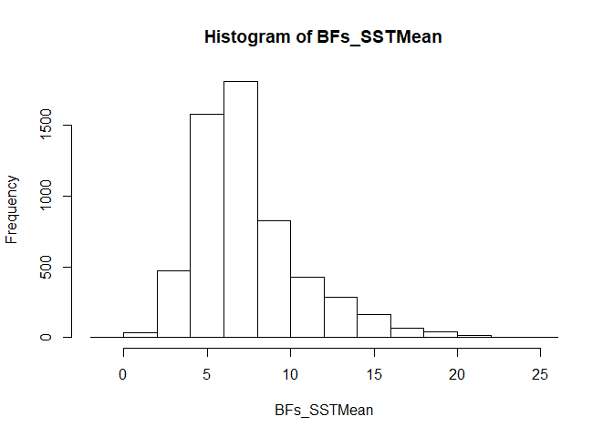

BayPass (Part II) Key
================

Once BayPass has finished running, take a look at the output files you have generated. You should see 6 newly created files, each with the prefix `BayPass_aux_output_`. Today, we are only concerned with the output file titled `BayPass_aux_output_summary_betai.out`. (Although feel free to look at the other output files if you would like.) Open up that file now.
\
\
Each line of the file corresponds to a unique locus/environmental variable combination. This file has columns in the following order:

-   Environmental variable of interest (the number corresponds to the order in which the variables occur in the `.env` input file)
-   Marker number
-   Posterior mean of the regression coefficient
-   Standard deviation of the regression coefficient
-   Posterior mean of the auxiliary variable
-   Bayes Factor estimate for comparison of null model to auxiliary model

We are going to focus on the last column, with the Bayes Factor estimates. We will use these estimates to determine if a locus is significantly correlated with a given environmental variable or not.
\
\
Bayes Factors can be thought of as odds ratios. They quantify the support for one model compared to another model (in our case, support for the auxiliary model as compared to the null model.) The greater the support for the auxiliary model, the greater the Bayes Factor, and the association of that SNP with a given environmental covariable. Bayes Factors with a value between 15 and 20 are considered to be "very strong evidence" for selection, while Bayes Factors &gt;20 are considered to be "decisive evidence" for selection. For our purposes, we will consider **any SNP with a Bayes Factor &gt;20 to be under selection**, and strongly correlated with the environmental variable of interest.
\
\
*Look at covariable 1, marker 6. What is the BF (in dB units)?*
\
\
**9.96112704**
\
\
*Is this marker significantly correlated with environmental covariable 1, based on our cut-off value?*
\
\
**No it is not, as 9.96112704 is &lt; than the cut-off value of 20.**
\
\
Go ahead and close out of the output file when you are finished.

***Formatting the output file***
--------------------------------

As you can tell, this output file gives us a lot of extra information that we are not interested in. It also is not formatted in a way that makes it easy to draw comparisons between environmental variables or identify loci that could be under selection.
\
\
We've created an R script to help us reformat our output file in a way that is easier to interpret.
\
\
First, make sure you are logged in to your Turing account and type:

``` bash
salloc -c 12
bash -l
```

Navigate to your workspace Next, load R and the necessary packages:

``` bash
module load R/3.4 tidyverse/
R
```

Then, load the formatting script into R:

``` r
source("/cm/shared/courses/Bioinfo_Workshop/clownfish_data/pull_BFs.r")
```

Quit from R by typing

``` r
q()
```

R should have made two text files for you. (Feel free to open the script with less to see how these files were created.) Open the file titled `all_BFs.txt`. In this file, each row corresponds with a unique marker (SNP). The first three columns identify what SNP each row contains information for. The last five columns list the Bayes Factor of that marker for each of our five environmental variables.
\
\
*What is the Bayes Factor of marker \#198 for SST Mean? Is this SNP associated with this environmental variable?*
\
\
**25.71042991; it is under selection (or associated with) SST Mean**
\
\
Close this file and open another one titled `candidate_BFs.txt`. (This should be in your workspace, as it was also created by the R script you just ran.) This file has a list of all loci that are under selection for at least one of the environmental variables.
\
\
We are going to create a histogram in R to look at the distribution of our Bayes Factors.
\
\
Open up R by typing

``` bash
module load R/3.4 data.table/1.11
R
```

Type the following commands to create your histogram

``` r
require(data.table)
data <- fread("all_BFs.txt")
BFs_SSTMean <- data$SST_Mean
pdf(width=4, height=4, file="SSTmean_histogram.pdf")
hist(BFs_SSTMean)
dev.off()
```

Quit from R by typing

``` r
q()
```

Transfer the pdf of your histogram and the two text files created by the R script (`all_BFs.txt` and `candidates_BFs.txt`) to your local computer. Open up the histogram pdf. 



*What range of Bayes Factors is the most common?*
\
\
**BFs of 5-15 are most common.**
\
\
*Do most of our loci appear to be under selection? Or not?*
\
\
**No, most of our loci don't appear to be under selection (or at least associated with this variable), as most BFs &lt; cut-off value of 20.**
\
\
Close out of the histogram file when finished.

***Data exploration***
----------------------

Open up the two text files you transferred in Excel. Now is your chance to explore these data and see if you can identify any patterns of selection.
\
\
*Which environmental variable(s) have the most SNPs significantly associated with them?*
\
\
**SST\_Max has the most (684 loci)**
\
\
*Do any environmental variables have no significantly associated SNPs? If so, which one(s)?*
\
\
**SSS\_Mean and latitude do not have any**
\
\
Look at the spreadsheet with the Bayes Factors for all markers and all environmental variables together. Try sorting these data in different ways, and create scatter plots or color code these data if you feel it might be useful.
\
\
*If a locus is under selection, is it associated with every environmental variable? Or just one or two?*
\
\
**It's usually associated with only one or two (although some are associated with all three temperature variables). No loci are associated with every single variable.**
\
\
*Are there any environmental variables that appear to be associated? (For example, loci that are associated with one variable are usually associated with the other as well, or have similar Bayes Factors for both environmental variables.)*
\
Hint: It may be helpful to create correlation or scatter plots that compare the results of different environmental variables.
\
\
**SST\_Min and SST\_Mean appear to be associated, as most loci have similar Bayes Factors for both.**
\
\
*Do BayPass and the program we ran earlier this morning (BayeScan) tend to identify the same candidate loci? What are some of the loci that were considered to be under selection in both programs?*
\
\
**All the loci BayeScan identified as candidate loci BayPass also identified as candidate loci except for TRINITY\_DN21269\_c0\_g1\_i1, 300. BayPass also identified far more loci as well.**
\
\
*What are some loci that were considered to be under selection in BayPass but not BayeScan, or vice versa?*
\
\
**Many potential answers**
\
\
*Why do you think the two programs didn't always identify the same loci?*
\
\
**They didn't always identify the same loci as they used different methods (*F*<sub>*ST*</sub> outlier vs. environmental association analysis).**
\
\
*What are some pros and cons of using BayPass to identify candidate loci? Which program (BayPass or BayeScan) would you be more likely to use in the future? Why?*
\
\
**PROS: BayPass enables a form of hypothesis testing for different selective pressures while also looking for signatures of seelction by checking for associations with environmental variables. It is a good complement to tests using outlier methods.**
\
**CONS: The results of BayPass are dependent on the environmental variables included in the test - just because there is no association doesn't mean no loci are under selection, and just because there is a selection doesn't mean selection must be happening. It uses a linear model to test for environmental associations which may not always be realistic. (Although BayPass also has a version of an *F*<sub>*ST*</sub> outlier test one can use, we just didn't in this lab.)**