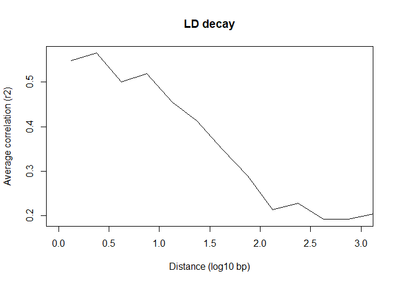

Hardy-Weinberg Proportions (HWP) & Linkage Disequilibrium (LD) Key
================

First, we are going to pick up where we left off this morning thinking about expected heterozygosity, observed heterozygosity, and Hardy-Weinberg proportions (HWP). Remember that departure from HWP can indicate non-random mating, strong selection acting on a locus, or other evolutionary forces at play.
\
\
Look back to the first section of the heterozygosity lab, where we calculated the frequencies for allele 1 and allele 2, *H*<sub>*e*</sub> and *H*<sub>*o*</sub> by hand. Write these values down below
\
\
*Frequency of allele 1*: **0.1875**
\
\
*Frequency of allele 2*: **0.8125**
\
\
*H*<sub>*e*</sub>*: **0.304688**
\
\
*H*<sub>*o*</sub>*: **0.375**
\
\
Open up the Excel file from the previous lab if you closed it out earlier.

***HWP by hand***
-----------------

Let's go further than judgment and see if we can construct a test for this one locus. Let's divide the samples into three genotypes: the *homozygotes* for allele 1 (the 1,1 individuals), the homozygotes for allele 2 (the 2,2 individuals) and the *heterozygotes* (the 1,2 individuals). Note that our locus has 2 alleles.
\
\
If we have Hardy-Weinberg proportions, we expect the number of homozygotes from allele 1 and allele 2 to be
\
\
*E*[*Homozygotes*<sub>1</sub>]=*Np*<sub>1</sub><sup>2</sup> = 8*p*<sub>1</sub><sup>2</sup> = *E*<sub>1</sub>
\
\
*E*[*Homozygotes*<sub>2</sub>]=*Np*<sub>2</sub><sup>2</sup> = 8*p*<sub>2</sub><sup>2</sup> = *E*<sub>2</sub>
\
\
where *N* is the number of individuals and the *p*<sub>*k*</sub>s are the allele frequencies of each allele. Similarly, we expect the number of heterozygotes to be everything else, which we can calculate as
\
\
*E*[*Heterozygotes*]=*N*(1-*sum*[*p*<sub>*k*</sub><sup>2</sup>]) = 8(1 - *p*<sub>1</sub><sup>2</sup> - *p*<sub>2</sub><sup>2</sup>) = *E*<sub>3</sub>
\
\
Calculate the *E*\[*Hom*<sub>1</sub>\], *E*\[*Hom*<sub>2</sub>\] and *E\[Het\]* calculations using the allele frequencies you recorded above
\
\
*E*\[*Hom*<sub>1</sub>\]=*E*<sub>1</sub>= ***N**p*<sub>1</sub><sup>2</sup> = 8 x 0.1875 x 0.1875 = 0.28125**
\
\
*E*\[*Hom*<sub>2</sub>\]=*E*<sub>2</sub>= ***N**p*<sub>2</sub><sup>2</sup> = 8 x 0.8125 x 0.8125 = 5.28125**
\
\
*E*\[*Het*\]=*E*<sub>3</sub>= ***N*(1 - *p*<sub>1</sub><sup>2</sup> - *p*<sub>2</sub><sup>2</sup>) = 8(1 - 0.035156 - 0.660156) = 8(0.304688) = 2.4375**
\
\
The observed numbers of homozygotes and heterozygotes can be found by counting them up in your file. What are they?
\
\
*O*\[*Hom*<sub>1</sub>\]=*O*<sub>1</sub>= **0**
\
\
*O*\[*Hom*<sub>2</sub>\]=*O*<sub>2</sub>= **5**
\
\
*O*\[*Het*\]=*O*<sub>3</sub>= **3**
\
\
To test whether the observed values (*O*<sub>1</sub>, *O*<sub>2</sub>, and *O*<sub>3</sub>) match the values expected under HWP (*E*<sub>1</sub>, *E*<sub>2</sub>, and *E*<sub>3</sub>), we use a chi-squared (*X*<sup>2</sup>) test. The traditional *X*<sup>2</sup> test takes the form
\
\
*X*<sup>2</sup> = *sum*[(*O*<sub>*j*</sub> - *E*<sub>*j*</sub>)<sup>2</sup>/*E*<sub>*j*</sub>] = (*O*<sub>1</sub> - *E*<sub>1</sub>)<sup>2</sup>/*E*<sub>1</sub> + (*O*<sub>2</sub> - *E*<sub>2</sub>)<sup>2</sup>/*E*<sub>2</sub> + (*O*<sub>3</sub> - *E*<sub>3</sub>)<sup>2</sup>/*E*<sub>3</sub>
\
\
Let's calculate that value from the data.
\
\
*What is your *X*<sup>2</sup> value? Show your work.*
\
\
***X*<sup>2</sup> = (0-0.28125)^2/0.28125 + (5-5.28125)^2/5.28125 + (3-2.4375)^2/2.4375**
\
***X*<sup>2</sup> = 0.28125 + 0.01498 + 0.12981 = 0.42604**
\
\
We can compare this answer against a *X*<sup>2</sup>-table to determine statistical significance. With three classes (two homozygote classes and one heterozygote class), we have one degree of freedom (DF). For a *X*<sup>2</sup> with one DF, we have a critical value of 3.84. This critical value means that a value in excess of 3.84 has only a five percent (5%) chance of occurring under the null hypothesis of HWP. We typically say that we reject the null hypothesis of HWP if *X*<sup>2</sup> &gt; 3.84.
\
\
*How large is your answer, compared with the critical value of 3.84? Can we reject the null hypothesis of HWP?*
\
\
**My answer is much smaller than the critical value of 3.84. We cannot reject the null hypothesis of HWP.**
\
\
*A locus can be out of HWP due to either a heterozygote excess or a deficit. What processes could cause either a heterozygosity excess or deficit to occur in a population?*
\
\
**A heterozygosity deficit could be caused by inbreeding or Wahlund's effect (population subdivision that is unaccounted for). A heterozygosity excess could be caused by balancing selection or heterozygote advantage.**
\
\
*What process could cause one locus to be out of HWP in several populations?*
\
\
**Selection could cause one locus to be out of HWP in several populations (or any othe locus-specific evolutionary process).**
\
\
Exit out of Excel when you are done.

***Calculating LD***
--------------------

Linkage disequilibrium (also called gametic disequilibrium) is the non-random association of alleles at two different loci. For example, imagine two loci. One has alleles A and T and the other has C and G. These two loci would be in strong linkage disequilibrium if A always appears with C, and T always appears with G. We generally find stronger linkage between loci that are physically close to each other on a chromosome or in regions of a chromsome with less recombination, and between loci on which selection is acting jointly.
\
\
Open up PuTTY and log on to your Turing account. Type

``` bash
salloc -c 12
bash -l
```

Then navigate to your workspace

``` bash
cd /cm/shared/courses/Bioinfo_Workshop/Workspace/yourworkspace/
```

Today, we only want to calculate linkage disequilibrium for individuals from the Japanese population. To do so, we need to create a text file that specifies which individuals to keep and which to exclude. Create a new file by typing

``` bash
nano J_individuals.txt
```

The text file is super simple: it just needs to have the names of all the individuals that we want to group together in a population. The names need to match what is in the .vcf file. Therefore, enter the following information (make sure to put each individual ID on a separate line):

``` bash
J3
J5
J9
J11
J13
J15
J17
J19
```

To exit nano, look at the bottom of the screen. You will see that it says `^X` for Exit. This means `Control X`. Type that, then follow the instructions to save the file as `J_individuals.txt`.
\
\
vcftools conveniently calculates *r*<sup>2</sup> (a measure of LD) between pairs of loci for us. To do this type (all on one line)

``` bash
module load vcftools/0.1
```

``` bash
vcftools --vcf /cm/shared/courses/Bioinfo_Workshop/clownfish_data/output.hicov2.snps.only.vcf --geno-r2 --ld-window-bp 5000 --keep J_individuals.txt --out ld_J
```

Arguments we used:

-   **--vcf** ----------- read in data from a VCF file
-   **--geno-r2** ------- calculate LD as squared correlation coefficient between genotypes
-   **--ld-window-bp** -- defines maximum number of bases between SNPs being tested
-   **--keep** ---------- specify name of the text file with individuals to include in analysis
-   **--out** ----------- specify name of output file

Now open the output file in less

``` bash
less ld_J.geno.ld
```

This file is organized in columns:

-   **CHR:** The name of the chromosome (or in our case, the contig from the transcriptome)
-   **POS1:** The position of the first locus
-   **POS2:** The position of the second locus
-   **N\_INDIV:** The number of individuals for which genotypes were available at these loci
-   **R^2:** The squared correlation coefficient between genotypes (`-nan` means a calculation was not possible)

Remember that you can search within less by typing `/` and the search string. Since a period (.) usually means any character, you can put a `\` before a period to force less to look for an actual period, as in

``` bash
/0\.5
```

to look for "0.5" in the file. You can move to the next instance of the search string by typing

``` bash
n
```

*Please find five (5) pairs of loci with *r*<sup>2</sup> &gt; 0.8 and list them here. (Please list both contig name and position of the SNPs.)*
\
\
**Many different answers.**
\
\
*What does high LD imply about the statistical independence between the loci in each pair?*
\
\
**High LD means that the loci are not statistically independent. The outcome (allele) at one locus impacts the outcome (allele) at the other locus.**
\
\
Quit from less when you are done

``` bash
q
```

***Make a plot of LD vs. distance between SNPs***
-------------------------------------------------

We are going to make a plot from these data to show how linkage changes on average as the distance between pairs of loci increases. To do so, we will use a statistical program called R. R is very flexible and useful for a wide range of tasks, but we'll learn more about it next week. Type:

``` bash
module load R/3.4 data.table/1.11
R
```

R can be customized by loading specialized functions that come in packages. We'll load one package that is useful for reading and working with large data files:

``` r
require(data.table)
```

Now we'll read in the file with our LD data:

``` r
dat <- fread("ld_J.geno.ld")
```

It will be easier if we remove a strange character (^) from one of the column names:

``` r
setnames(dat, 5, "r2")
```

We can then calculate the *l**o**g*<sub>10</sub> distance between each pair of sites:

``` r
dat[,logdist:=log10(abs(POS2-POS1))]
```

We want to calculate average LD for all pairs of loci with a similar distance apart. Here, we'll round distance down to the nearest multiple of 0.25 *l**o**g*<sub>10</sub> basepairs apart:

``` r
dat[,distclass:=floor(logdist/0.25)*0.25+0.25/2]
```

We can then easily calculate average *r*<sup>2</sup> within each distance class:

``` r
bins <- dat[!is.na(r2),.(r2ave=mean(r2)), by=distclass]
```

Now sort by distance class:

``` r
setkey(bins, distclass)
```

And make a plot of average *r*<sup>2</sup> vs. *l**o**g*<sub>10</sub> distance! We will write the plot straight to a PDF file on Turing. The `pdf()` command starts the plot, and the `dev.off()` command ends writing to the plot.

``` r
pdf(width=4, height=4, file="ld_decay.pdf")
bins[,plot(distclass, r2ave, type="1", xlab="Distance (log10 bp)", ylab="Average correlation (r2)", main="LD decay", xlim=c(0,3))]
dev.off()
```

Quit from R by typing:

``` bash
q()
```

And then typing

``` bash
n
```

To choose not to save your workspace (it's not necessary).
\
\
Now use WinSCP to download the pdf that you just made to your local computer. The absolute path to the pdf is

``` bash
/cm/shared/courses/Bioinfo_Workshop/Workspace/yourworkspace/ld_decay.pdf
```

!


*Please describe how linkage between loci varies as a function of physical distance between them.*
\
\
**Linkage decreases as physical distance increases.**
\
\
*At what distance (in bp) does average LD flatten out to a low value?*
\
Hint: The x-axis on your graph is in *log*<sub>10</sub> bp so you will have to convert back to bp.
\
\
**LD flattens out to a low value at a distance of ~100 bp.**
\
\
*We ran this analysis on data from RNAseq. How does this affect the analysis, compared to a similar analysis that might be run on RADseq or whole genome sequencing data?*
\
\
**RNAseq means we are only looking at transcripts (short segments of mRNA). We can look for physical linkage within one contig but we can't look across contigs as we don't know physically where these contigs are located in the genome (no reference genome/transcriptome for this species). RADseq or whole genome sequencing data would let us look across larger stretches of DNA at once, as well as non-coding DNA.**
