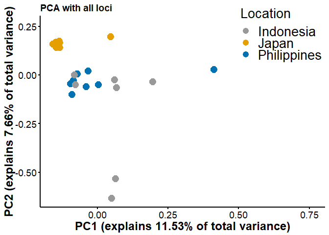

Principal Component Analysis (PCA) Key
================

There are many ways to analyze population genetics data. One method is called principal components analysis, or PCA. PCA considers all the variation at all the loci among all the individuals and simplifies it down to a much smaller number of variables (two is often particularly convenient). Individuals close to each other in a PCA are similar, while those far apart are quite divergent. PCA is used in many branches of science and statistics other than population genetics.

***Trim to our set of putatively neutral SNPs***
------------------------------------------------

Log on to Turing.
We made a list of SNPs that are putatively under selection from our BayPass analysis, so we'll exclude them from our analysis before proceeding.
Let's look at this file, which has chromosome (contig) names and SNP positions separated by tabs:

``` bash
salloc -c 12
bash -l

less /cm/shared/courses/Bioinfo_Workshop/clownfish_data/outlier_candnames.txt
```

Then run vcftools to drop these loci (remove them from our vcf). From your workspace type:

``` bash
enable_lmod
module load vcftools/0.1
```

Type (all on one line)

``` bash
vcftools --vcf /cm/shared/courses/Bioinfo_Workshop/clownfish_data/output.hicov2.snps.only.vcf --exclude-positions /cm/shared/courses/Bioinfo_Workshop/clownfish_data/outlier_candnames.txt --recode --recode-INFO-all --out clownfish_nooutliers
```

Arguments we used:

-   **--vcf** ------------------- read in data from a VCF file
-   **--exclude-positions** ----- remove any SNPs listed in the specified file
-   **--recode** ---------------- write out a new VCF file
-   **--out** ------------------- name of the output file

Check to see that the output file was created

``` bash
ls -lhtr
```

You should see your new file at the bottom (`clownfish_nooutliers.recode.vcf`), about 8 MB.

***Run plink***
---------------

For our PCA today, we will use the plink program. Like vcftools, it is a multi-function population genetics program that can run a wide range of basic analyses. Type

``` bash
module load plink
```

Then type (all on the same line)

``` bash
plink2 --pca var-wts vcols=chrom,pos,maj,nonmaj --bad-freqs --allow-extra-chr --vcf clownfish_nooutliers.recode.vcf --out nooutliers
```

Arguments we used:

-   **--pca** ----------------- run PCA & report how much SNPs contribute to PC axes
-   **--bad-freqs** ----------- force plink to run despite small sample sizes (&lt;50)
-   **--allow-extra-chr** ----- allow chromsomes that aren't human (1-23)
-   **--bad-freqs** ----------- read in data from a VCF file

That was it. It probably didn't even take that long.
\
\
You'll also notice that plink wrote a few things to the screen. One line says how many variants (SNPs) and samples passed filters and QC (quality control).
\
\
*How many samples were analyzed? How many SNPs?*
\
\
**25 samples were analyzed at 5640 SNPs**
\
\
The output file that we are especially interested in is the one with the extension `.eigenvec`. This file contains each individual's loadings on each of the principal components, and it is these loadings that we will plot to visualize the data.
\
\
In addition, we will also look at the `nooutliers.eigenvec.var` file. It tells us how much each SNP contributes to each principal component.

***Download data output***
--------------------------

Use WinSCP on your Desktop to download the `nooutliers.eigenvec` and `nooutliers.eigenvec.var` files to your local computer (saving to the desktop or in your Documents is fine).

***Make a PCA plot***
---------------------

Open Microsoft Excel and import the plink2.eigenvec file into Excel. You may have to tell Excel to show you `any file` (not just those ending in .txt, .csv, or .xlsx). It will ask you how you want to import the file. Use `Delimited` and make sure `Space` is checked so that it will create a column break when it finds a space.
\
\
The file should now display as a series of columns:

-   Sample names are in the first full column
-   The remaining columns include the coordinates of each individual along the PCA axes

Now you can plot your output!!
\
\
It is best to start by comparing principal components 1 & 2 (the first two columns after the sample names) because these will explain the largest variance in the data. Go ahead and do this if you know how, with each population as a separate data series (so that they are plotted as different symbols.)
\
\
If Excel is foreign to you, here's a short guide:

1.  Select all cells in the first two PCA columns for individuals in Japan
2.  Choose to insert a chart, and make it a scatter plot
3.  The Japan samples should be plotted
4.  Right click on the chart and choose `Select data`
5.  Add a new data series
6.  For the X values in the new series, select all the cells in the first PCA column for the Indonesia samples
7.  For the Y values in the new series, select all the cells in the second PCA column for the Indonesia samples
8.  Add a new data series for the Philippines (same as for Indonesia)
9.  Click `OK` and look at it!

If populations are significantly differentiated, then we expect to see clustering of individuals by their respective populations. This clustering will not necessarily occur on the first several principal components though, so you may want to create graphs of the first vs. third PCs, first vs. fourth, etc., to see the major patterns in the data.

    ## Warning: package 'tidyverse' was built under R version 3.4.4

    ## -- Attaching packages ----------------------------------------------------------------------------------------------------------- tidyverse 1.2.1 --

    ## v ggplot2 3.1.0     v purrr   0.2.4
    ## v tibble  1.4.1     v dplyr   0.7.4
    ## v tidyr   0.7.2     v stringr 1.2.0
    ## v readr   1.1.1     v forcats 0.3.0

    ## Warning: package 'ggplot2' was built under R version 3.4.4

    ## Warning: package 'forcats' was built under R version 3.4.4

    ## -- Conflicts -------------------------------------------------------------------------------------------------------------- tidyverse_conflicts() --
    ## x dplyr::filter() masks stats::filter()
    ## x dplyr::lag()    masks stats::lag()

    ## Parsed with column specification:
    ## cols(
    ##   .default = col_double(),
    ##   Location = col_character(),
    ##   Individual = col_character()
    ## )

    ## See spec(...) for full column specifications.


*Do individuals within populations cluster together? Why do you think so (or not)?*
\
\
**Individuals don't really cluster by population. All the populations tend to overlap one another (although the Japanese population tightly groups within that larger cluster). This is likely because we are not using outlier loci, and a larger genome-wide signal is not very apparent (no differentiation due to population structure, inbreeding, etc.).**
\
\
*Do any individuals not cluster within their populations? If so, which populations do they belong to? Why do you think this is happening?*
\
\
**The Indonesian population is fairly spread out (at least compared to the populations from Japan and the Philippines). There could be subdivision within this population that results in this spread.**
\
\
*Does changing the principal components you compare change the way individuals cluster? (E.g. comparing PC 1 to PC 3 vs. comparing PC 2 to PC 3, etc.)*
\
\
**Yes**
\
\
Don't exit out of Excel yet.

***Understand which loci contribute to the PCA axes***
------------------------------------------------------

Now we'll understand which SNPs are important for driving the patterns in the PCA plot. The importance is stated in terms of "loadings," which reflect the degree to which the allele at each SNP affects the position of an individual along a PC axis.
\
\
Open `nooutliers.eigenvec.var` from within Excel.
\
\
Each line is a SNP in our dataset. The columns are:

-   **CHROM:** The chromosome (in our case, contig) on which the SNP is found
-   **POS:** The position in basepairs along the contig
-   **ID:** Name of the SNP, if available
-   **MAJ:** The reference allele
-   **NONMAJ:** The alternative allele
-   **PC1-10:** The loadings of each SNP on each PC axis

Make sure either none of the data sheet is selected, or all of it is selected. Choose `sort` from the `data` menu and ask Excel to sort your data on the PC1 axis (from smallest to largest).
\
\
Check that this worked: you should see negative values for PC1 at the top, and positive values at the bottom.
\
\
*Which 5 SNPs are most strongly, positively loaded on PC1? Are any of these SNPs on the same contig?*
\
\
**TRINITY\_DN30917\_c0\_g1\_i1, 405**
\
**TRINITY\_DN30917\_c0\_g1\_i1, 414**
\
**TRINITY\_DN30917\_c0\_g1\_i1, 415**
\
**TRINITY\_DN30917\_c0\_g1\_i1, 436**
\
**TRINITY\_DN38287\_c0\_g1\_i1, 721**
\
**4 out of the 5 SNPs are on contig TRINITY\_DN30917\_c0\_g1\_i1**
\
\
Switch back to Turing when you are done.

***Optional: Run PCA with only candidate non-neutral loci***
------------------------------------------------------------

If you have time, repeat the PCA analysis, but trim only to the outliers for your input file to plink. Type (all on one line):

``` bash
vcftools --vcf /cm/shared/courses/Bioinfo_Workshop/clownfish_data/output.hicov2.snps.only.vcf --positions /cm/shared/courses/Bioinfo_Workshop/clownfish_data/outlier_candnames.txt --recode --recode-INFO-all --out clownfish_outliersonly
```

This will create a file called `clownfish_outliersonly.recode.vcf` that you can use as input to plink.
\
\
Now type (all on the same line)

``` bash
plink2 --pca var-wts vcols=chrom,pos,maj,nonmaj --bad-freqs --allow-extra-chr --vcf clownfish_outliersonly.recode.vcf --out outliersonly
```

Use WinSCP on your Desktop to download the `outliersonly.eigenvec` and `outliersonly.eigenvec.var` files to your local computer (saving to the desktop or in your Documents is fine). Open the files up in Excel and create a PCA, just as you did before.

    ## Parsed with column specification:
    ## cols(
    ##   .default = col_double(),
    ##   Location = col_character(),
    ##   Individual = col_character()
    ## )

    ## See spec(...) for full column specifications.


*How does the clustering of individuals along the PCA axes change as compared to the PCA you made with outliers?*
\
\
**Now Japanese individuals cluster distinctly from Indonesia and the Philippines, whose populations overlap each other almost exactly.**
\
\
*Has clustering by location become more or less clear compared to how individuals clustered in the PCA without outliers?*
\
\
**More clear**
\
\
*Why do you think the PCA looks different when you only include outlier loci?*
\
\
**The PCAs look different because only including SNPs that we know a priori are highly differentiated among locations (particularly Japan and Indonesia/Philippines), we should see this pattern visualized by the PCA. The previous PCA looked at SNPs that aren't highly differentiated among populations so we shouldn't expect to see much difference.**
\
\
Switch back to Turing when you are done.

***Optional: Run PCA with all loci (neutral and non-neutral) included***
------------------------------------------------------------------------

If you have time, repeat the PCA analysis, but use `/cm/shared/courses/Bioinfo_Workshop/clownfish_data/output.hicov2.snps.only.vcf` as your input file to plink.
\
\
Type (all on the same line)

``` bash
plink2 --pca var-wts vcols=chrom,pos,maj,nonmaj --bad-freqs --allow-extra-chr --vcf /cm/shared/courses/Bioinfo_Workshop/clownfish_data/output.hicov2.snps.only.vcf --out allsnps
```

Use WinSCP on your Desktop to download the `allsnps.eigenvec` and `allsnps.eigenvec.var` files to your local computer (saving to the desktop or in your Documents is fine). Open the files up in Excel and create a PCA, just as you did before.

    ## Parsed with column specification:
    ## cols(
    ##   .default = col_double(),
    ##   Location = col_character(),
    ##   Individual = col_character()
    ## )

    ## See spec(...) for full column specifications.



*How does the clustering of individuals along the PCA axes change as compared to the previous two PCAs you created?*
\
\
**The clustering is almost identical to the PCA with no outliers included (the orientation has just changed slightly and the populations overlap a bit less).**
\
\
*Has clustering by location become more or less clear compared to the previous two PCAs you created?*
\
\
**Clustering is much less clear than the PCA with only outliers but a bit more distinct than the PCA with outliers excluded. Japan tightly clusters but Indonesia and the Philippines individuals overlap a decent amount.**
\
\
*Does this PCA look more like the PCA with outliers only or the PCA with outliers excluded? Why do you think this is so?*
\
\
**This PCA looks very similar to the PCA with outliers excluded. This is likely because it represents the same genome-wide pattern. Even though the outlier loci are now included, the genome-wide signal of low differetiation swamps that signal out.**
